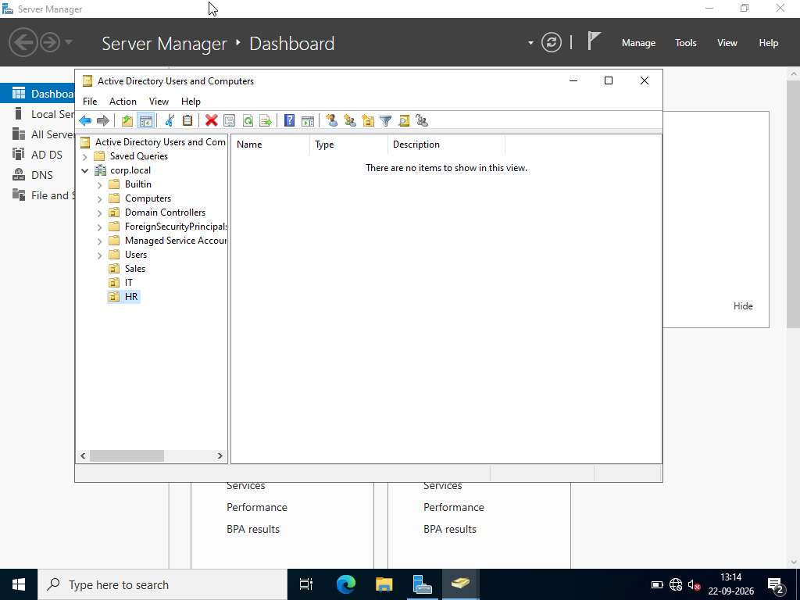
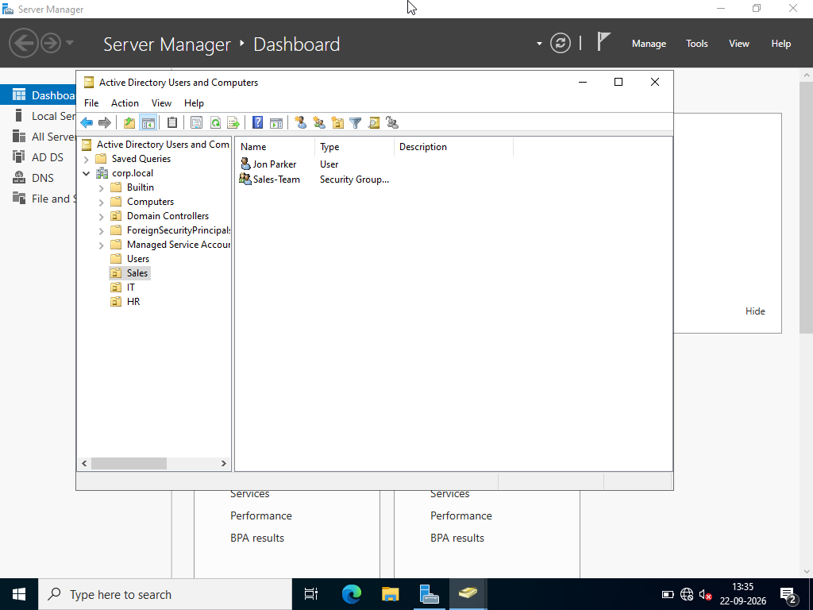
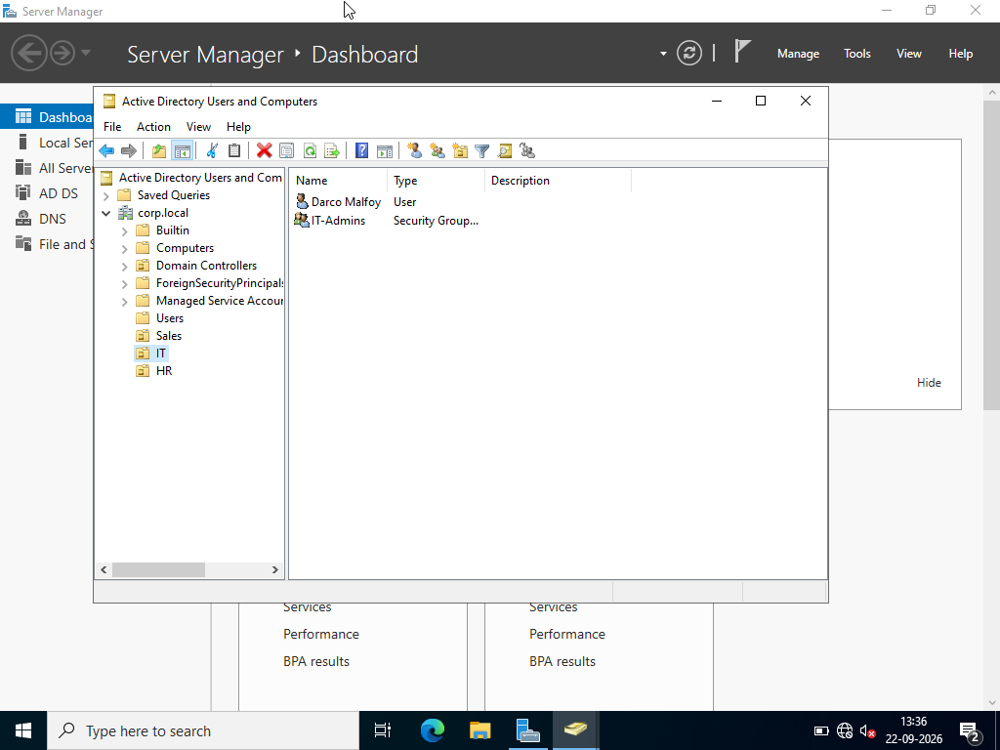
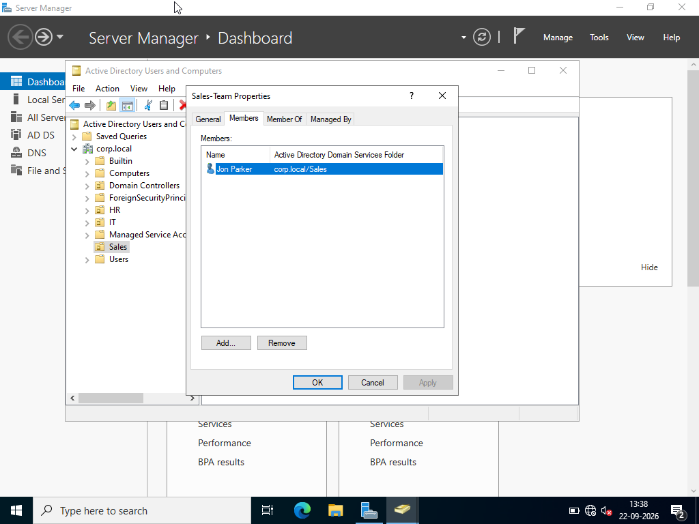
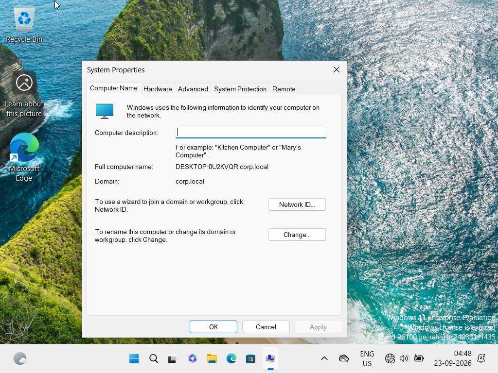
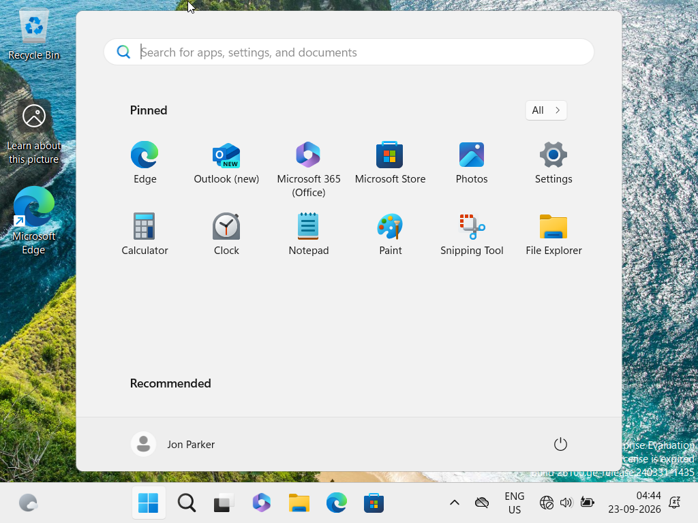
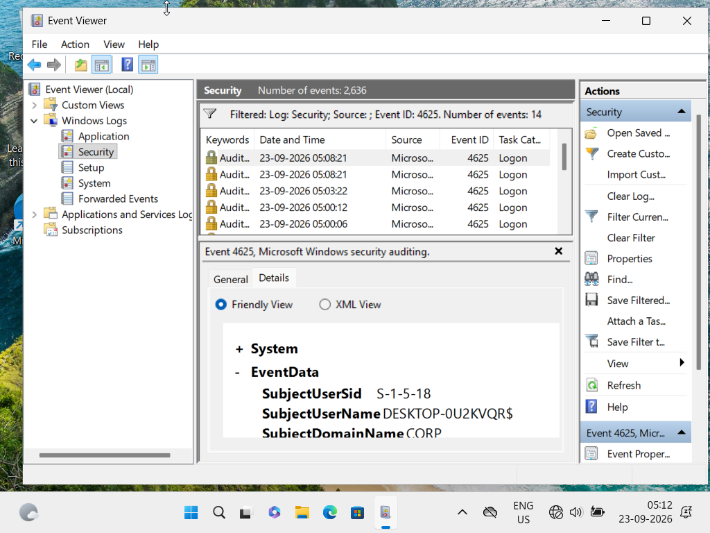

## Built My First Active Directory SOC Lab

### What I built

I wanted to stop just reading about how enterprise networks handle logins and actually build one myself, so I set up a small AD lab from scratch on my laptop using VirtualBox. Two VMs: a Windows Server 2022 box acting as the Domain Controller (DC01), and a Windows 11 machine joined to it as a client (Client01). Both sit on their own isolated network so nothing touches my actual home network.

On the DC I installed Active Directory Domain Services, promoted it, and created a domain called `corp.local`. Then I built out three OUs - Sales, IT, HR - and in each one added a test user and a matching security group.

After that I joined the Windows 11 client to the domain and logged in as one of the domain users - small thing, but it felt like a real milestone after all the setup. Then, to actually see the logging side of things, I deliberately typed the wrong password a few times on the client and went looking for the failed-logon event in Event Viewer, Event ID 4625.

### What AD actually does

Basically, AD is the one place that decides who's allowed to do what across the whole network. Instead of every machine keeping its own list of users and passwords, everything's defined once at the domain level, and every machine that joins trusts that central source. The Domain Controller holds all of it, and every login - no matter where it happens - gets checked against it.

### What I actually learned

Way more went wrong than I expected, honestly. Getting static IPs set correctly on both machines, making sure DNS pointed to the DC, keeping the internal network settings matched between the two VMs, even something as small as typing `CORP\username` instead of `username@corp.local` - any one of these being off broke things in ways that weren't obvious at first. I also picked the wrong Windows Server install mode early on (Server Core instead of Desktop Experience) and had to redo the whole install because of it.

The thing that genuinely surprised me: I assumed all the failed-login logging would show up on the Domain Controller since that's supposedly where authentication happens. It doesn't - the client logs its own local failed logins, and the DC logs a totally different set of events for whatever it's handling. I didn't expect logging to be spread out like that.

### What Event 4625 means

4625 just means "this login attempt failed." Wrong password, locked account, disabled account - all of it triggers this event. It shows up on whichever machine actually handled the logon attempt (for me, that was the client, not the DC), and the details include the account name, why it failed, and where the attempt came from.

### Why this actually matters for SOC work

One 4625 on its own usually means nothing - someone just fat-fingered their password. But a SOC analyst isn't watching one event at a time, they're watching for patterns: a bunch of 4625s in a short window, the same account failing over and over, or one account failing across a pile of different machines. That kind of pattern is usually the first sign something's wrong - brute force, someone testing stolen credentials, whatever. Building this made it click for me why knowing *where* these events actually land matters so much (and why related events on the DC, like 4771 for Kerberos failures, matter too) - you can't spot an attack across a network if you don't know which machine is logging what.
