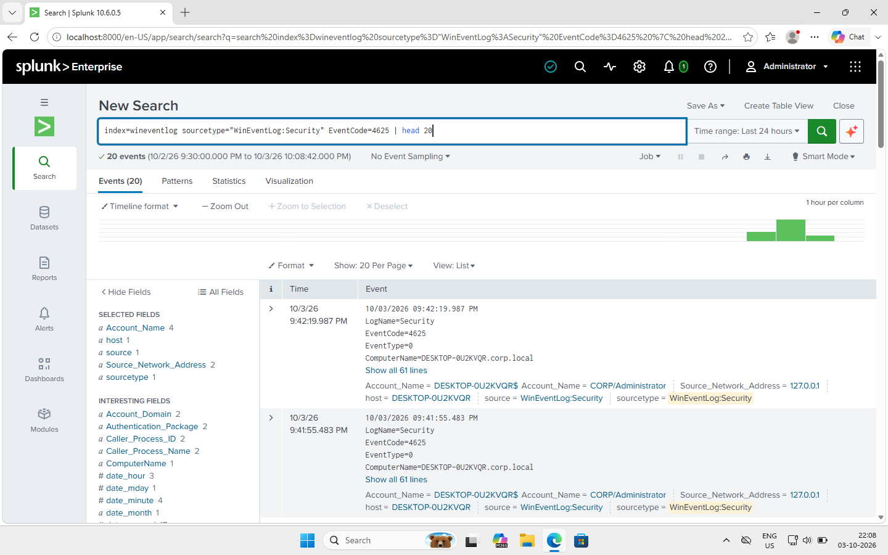
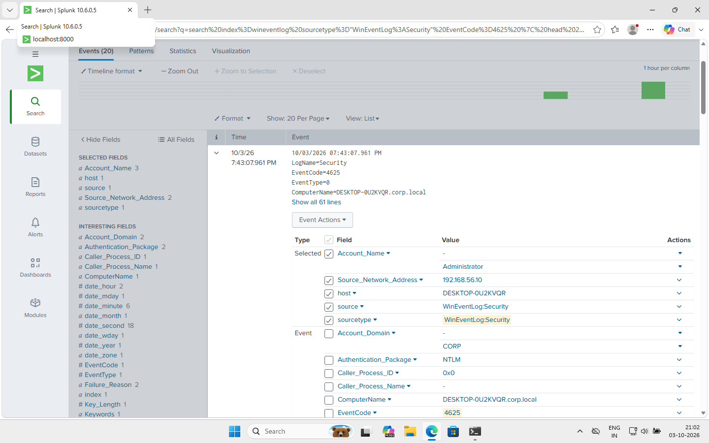
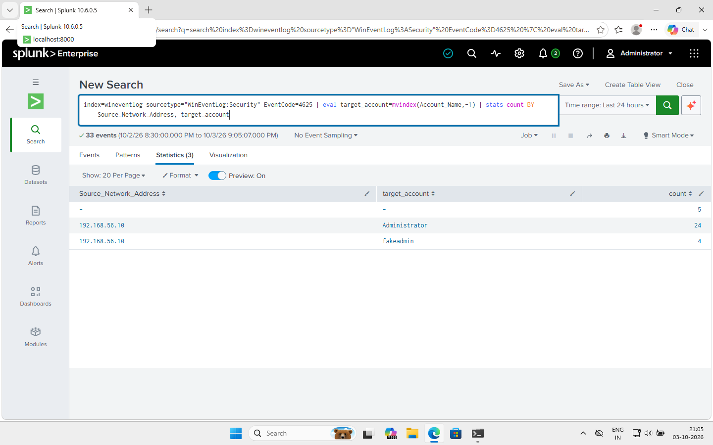
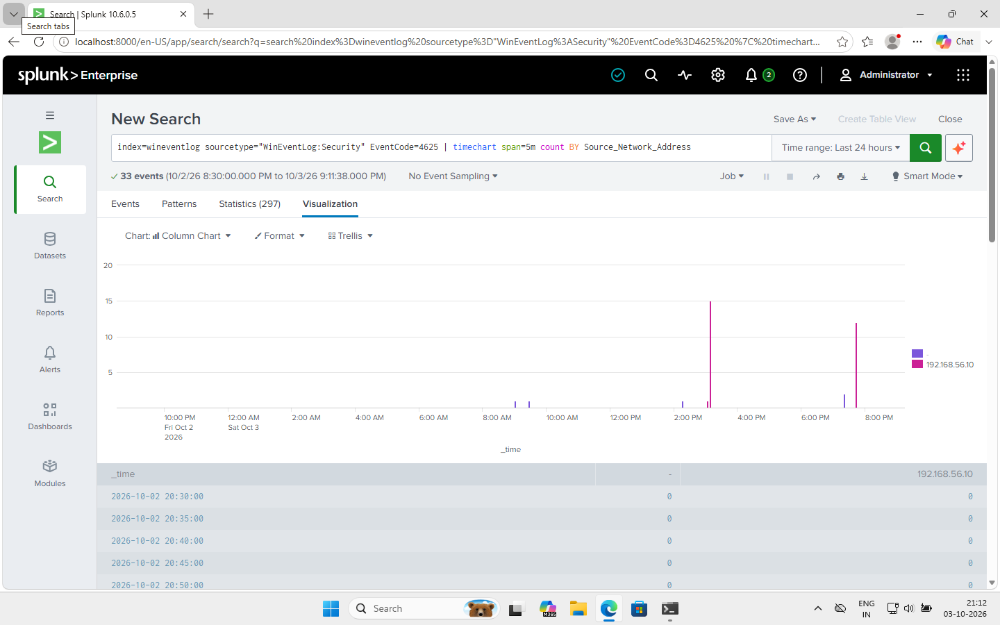
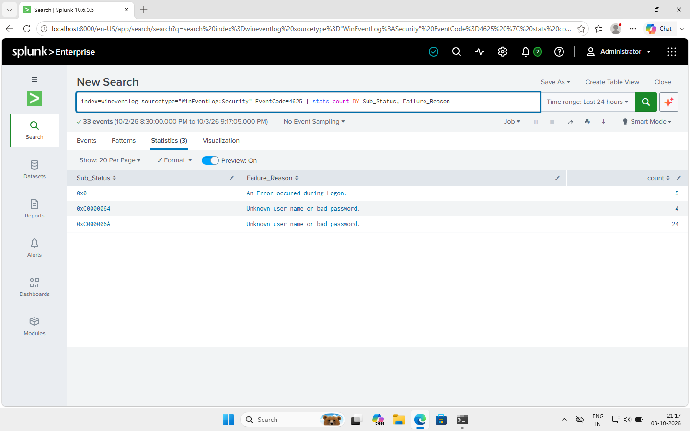
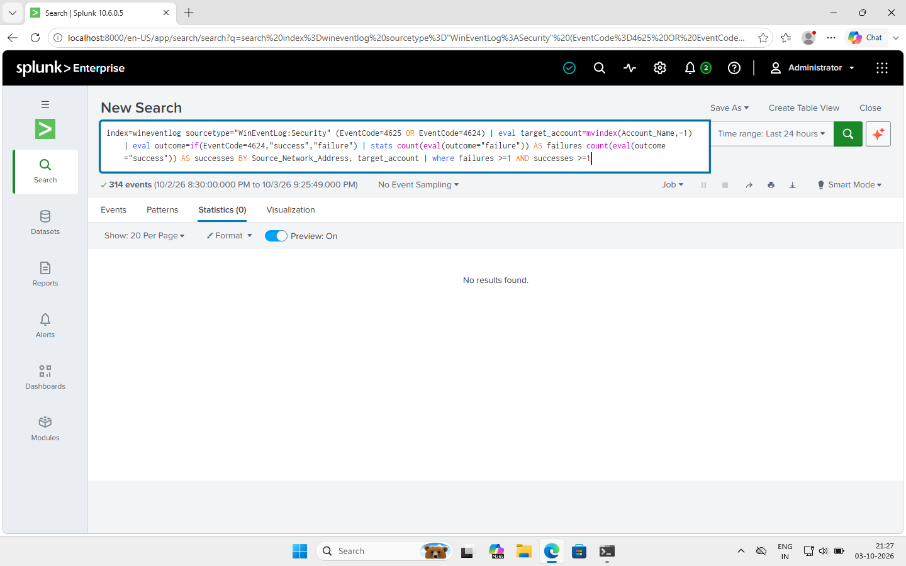
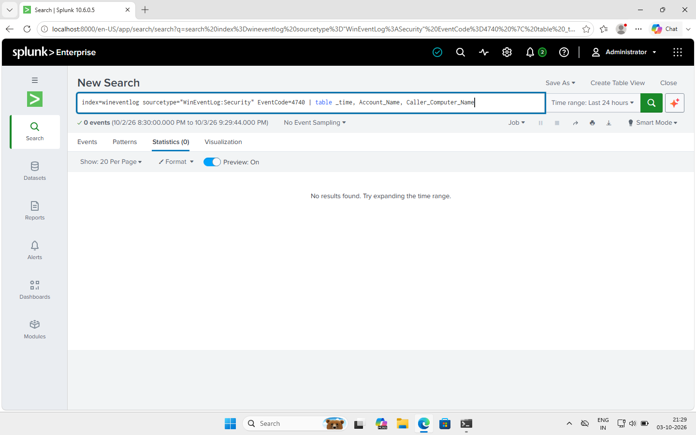
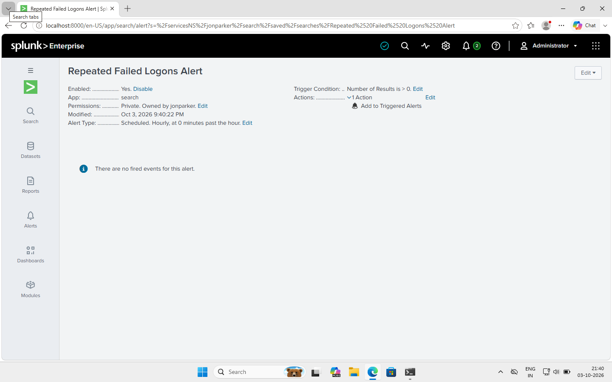

# Detecting Repeated Failed Logons with Splunk

After I got my Active Directory lab working, I wanted to go one step further and actually detect an attack in it, not just read about it. So I installed Splunk on Client01, attacked it from DC01, and tried to find the activity in the logs the way a SOC analyst would.

This ended up being a lot more hands-on than I expected. Half of this write-up is the actual investigation, and the other half is everything that broke along the way, which honestly taught me more than if it had worked on the first try.

## How I set this up

I installed Splunk Enterprise directly on Client01 and pointed it at the Windows Security event log, everything lives in an index I called `wineventlog`. To get real attack traffic instead of just testing locally, I went over to DC01 and ran failed login attempts against Client01 over the network using `net use`, targeting the Administrator account with wrong passwords, and a fake account that doesn't exist, so I'd have both kinds of failures to work with.

## Everything that went wrong first

Getting the attack to actually register properly took longer than the investigation itself. First, Client01 was rejecting the connection outright, File and Printer Sharing was off, so nothing from DC01 could even reach it. Once that was fixed, the attempts still failed in a strange way, `Status: 0xC0000133`, which turned out to be a Kerberos time-sync error: DC01 and Client01's clocks were too far apart for the domain to accept the login attempt at all. A few of my 33 failed events (the ones with `Sub_Status: 0x0`) are actually from this stage, before I got the clocks synced.

Even after that, my grouped query kept showing `-` instead of `Administrator` for the targeted account. Turned out a 4625 event logs two separate "Account Name" fields, one for the Subject (blank here) and one for the account actually being attacked, and Splunk was grabbing the wrong one by default. I fixed it with `mvindex(Account_Name,-1)`.

## The logs I'm working with

- **Index:** `wineventlog`
- **Sourcetype:** `WinEventLog:Security`
- **Event IDs used:** 4625 (failed logon), 4624 (successful logon), 4740 (account lockout)



<p align="center">
<br>
<em>First check that 4625 events were actually landing in Splunk and that the Account_Name field was populated correctly, before I moved on to the full attack from DC01.</em>
</p>
<br>

## Hunting for the attack

**First, I looked at one event up close**

Before writing any grouping logic, I expanded a single 4625 event just to see what fields were actually available.



*A single raw 4625 event, expanded to see every field it actually logs.*

This is where I found the two Account Name values, the real one being `Administrator`, and the source address, `192.168.56.10`, which is DC01.

**Then I grouped the failures by source and target account**

```spl
index=wineventlog sourcetype="WinEventLog:Security" EventCode=4625
| eval target_account=mvindex(Account_Name,-1)
| stats count BY Source_Network_Address, target_account
```



*Failures grouped by where they came from and which account they were aimed at.*

This gave me the real picture: **192.168.56.10 made 24 failed attempts against Administrator, and 4 more against a fake account called fakeadmin**, all from the same source. The blank row (5 events with no source or account) are the clock-sync failures from earlier, they never got far enough to even log who was being targeted.

**Then I wanted to see the timing**

```spl
index=wineventlog sourcetype="WinEventLog:Security" EventCode=4625
| timechart span=5m count BY Source_Network_Address
```



*Two sharp spikes, each packing over a dozen failures into a few minutes.*

The chart makes it obvious these weren't someone typing a password wrong once or twice, there are two sharp spikes, each with over a dozen failures packed into a few minutes. That burst pattern is the actual signature of an automated attack, not a human mistake.

**Next I checked why each one actually failed**

```spl
index=wineventlog sourcetype="WinEventLog:Security" EventCode=4625
| stats count BY Sub_Status, Failure_Reason
```



*Why each attempt actually failed, broken down by status code.*

- **24** failed with `0xC000006A`, wrong password for a real account
- **4** failed with `0xC0000064`, the account doesn't exist at all
- **5** failed with `0x0`, the clock-sync errors from my troubleshooting

**The question that actually matters: did anyone get in?**

Lots of failures on their own don't really mean much. A success right after them would.

```spl
index=wineventlog sourcetype="WinEventLog:Security" (EventCode=4625 OR EventCode=4624)
| eval target_account=mvindex(Account_Name,-1)
| eval outcome=if(EventCode=4624,"success","failure")
| stats count(eval(outcome="failure")) AS failures count(eval(outcome="success")) AS successes BY Source_Network_Address, target_account
| where failures >=1 AND successes >=1
```



*Checking whether any failed source later managed a successful logon.*

No results. As far as the logs show, DC01 never actually got into the Administrator account on Client01, it just kept failing.

**Last, I checked if any account got locked out**

```spl
index=wineventlog sourcetype="WinEventLog:Security" EventCode=4740
| table _time, Account_Name, Caller_Computer_Name
```



*Checking for any account lockout events (4740) triggered by the attack.*

No lockouts either, even with 24 wrong-password attempts against the same account. This tracks with something I learned in my AD lab: account lockout isn't automatic, it depends on the domain's lockout policy, and by default this lab doesn't have one configured.

## So what actually happened here

This is a **true positive**, it's an attack I ran myself to test the detection, but the pattern is exactly what a real brute-force attempt looks like: dozens of failed logins from one source, in short bursts, targeting both a real account (Administrator) and a made-up one. That mix is a pretty classic sign of password guessing rather than someone just mistyping their own password.

**MITRE ATT&CK:** this maps to **Brute Force (T1110)**, more specifically **Password Guessing (T1110.001)** since the attempts were aimed at a specific named account rather than spread across many accounts.

**Severity:** I'd call this medium. No successful logon and no lockout, but the volume and pattern alone would be worth an analyst's attention in a real environment, especially since it hit the built-in Administrator account.

## If this were real

If this showed up in an actual SOC:
1. Block or isolate the source address (192.168.56.10 in this case) while investigating further.
2. Check whether that source shows this pattern against any other machines on the network.
3. Since no lockout happened, I'd push for an actual account lockout policy, something like 5 attempts before a 15-minute lock, so this kind of attempt gets slowed down automatically next time.
4. Turn this detection into something that runs automatically instead of me checking manually.

That's the alert I built:

```spl
index=wineventlog sourcetype="WinEventLog:Security" EventCode=4625
| eval target_account=mvindex(Account_Name,-1)
| bin _time span=5m
| stats count AS failures dc(target_account) AS accounts BY _time, Source_Network_Address
| where failures >= 5
```

It runs hourly and triggers if any source racks up 5 or more failures in a 5-minute window.



*The saved alert, running hourly and triggering on 5+ failures in a 5-minute window.*

## What I actually learned from this

The investigation part, the SPL, the stats tables, wasn't the hard part. The hard part was everything underneath it: getting two VMs to actually talk to each other, realizing Kerberos cares about clock drift down to the minute, and discovering that a single event type can have two fields with the same name pointing at completely different things. None of that is something you'd learn just reading about Splunk, I only found it because the attack kept failing for reasons that had nothing to do with Splunk itself.

If I did this again, I'd check the firewall and time sync between my VMs before touching Splunk at all, that would've saved me the most time.


